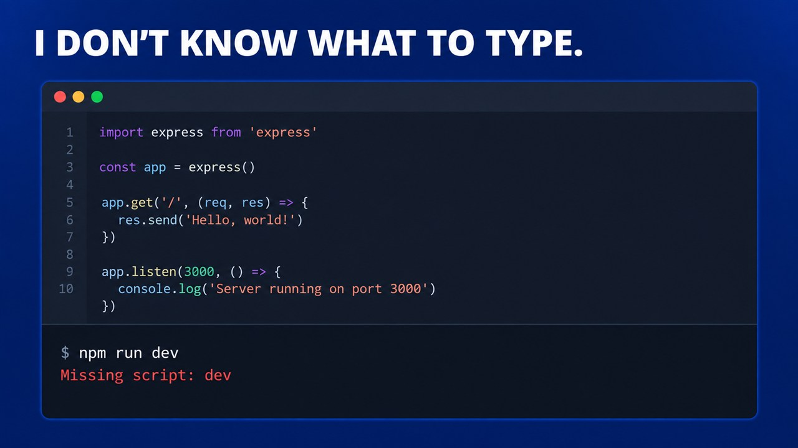
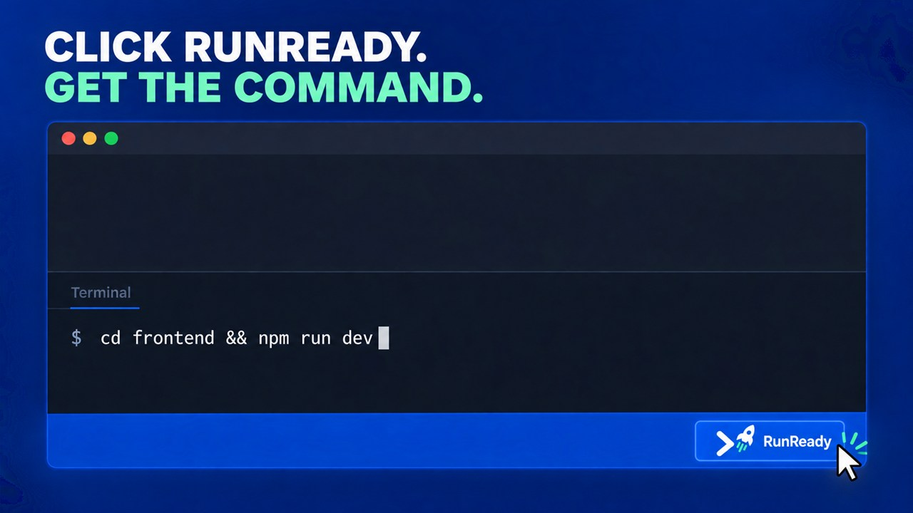

# RunReady

[](https://github.com/shxhxn/RunReady/actions/workflows/validate.yml)


**Not sure what command runs your project? Click RunReady.**

RunReady finds the correct project folder, checks whether dependencies are ready, and fills the complete command in your terminal. It also copies the command to your clipboard.

**Nothing runs automatically. You review the command and press Enter.**

## Install

- Download the latest `.vsix` from [GitHub Releases](https://github.com/shxhxn/RunReady/releases/latest), then in VS Code choose **Extensions: Install from VSIX...** from the Command Palette.
- Or install RunReady from the Visual Studio Marketplace when it is available there.

GitHub's automatically generated source archives are also available on every release page.

## Before RunReady



## With RunReady



## How it works

1. Open your project in VS Code.
2. Click **RunReady** in the status bar.
3. RunReady opens or reuses the terminal and fills the complete command.
4. Review it and press Enter when you are ready.
5. For recognized web servers, use the displayed **Open URL** or **Copy URL** action after the server starts.

The generated command can include:

- `cd` to the correct project directory.
- A dependency installation step when dependencies appear to be missing.
- The detected command that starts the project.

## Built-in project support

- Node.js and package scripts using npm, pnpm, Yarn, or Bun.
- React, Vite, Next.js, Nuxt, SvelteKit, Astro, Angular, Electron, Express, and VS Code extensions.
- Python, Streamlit, FastAPI, Flask, and Django, including README-documented commands, executable `__main__` files, and nested backend layouts.
- Rust/Cargo, Go, Java/Maven, Java/Gradle, .NET and F#.
- Flutter/Dart, PHP/Composer/Laravel, Ruby/Bundler/Rails.
- Deno, Swift packages, Elixir/Mix/Phoenix, and R/Shiny.
- Docker Compose, C/C++ with CMake, Make, Just, Taskfile, Procfile, and static websites.

Detection is based on project files, declared scripts, dependencies, and common entry points. If RunReady cannot find enough evidence, it will not invent a command.

## Unsupported or private toolchains

Add a `.runready.json` file to a project root:

```json
{
  "name": "My worker",
  "projectType": "Private toolchain",
  "command": "acme-worker serve",
  "setupCommands": ["acme-worker install"],
  "dependencyState": "unknown"
}
```

`dependencyState` can be `ready`, `missing`, `managed`, or `unknown`. Custom setup commands are included when the state is `missing` or `unknown` and **RunReady: Include Dependency Install** is enabled.

For multiple choices, replace `command` with:

```json
{
  "commands": [
    { "label": "Development server", "command": "acme dev", "recommended": true },
    { "label": "Production mode", "command": "acme start" }
  ]
}
```

## Dependency checks

For Node projects, RunReady verifies directly declared packages in `node_modules`, including hoisted workspace packages. It also checks recognized CSS and build-tool references such as Tailwind, PostCSS, Sass, and Less when they are missing from both the manifest and installed packages. For Python projects, it validates the local environment's actual interpreter, compares direct requirements with installed distribution metadata, repairs incomplete environments, and enables the selected environment only when it is not already active. Ecosystems such as Cargo, Go, Maven, and Gradle resolve dependencies through their own runners.

## Privacy and safety

RunReady works locally and does not send project data to an AI service. It fills commands without executing them. Project scripts can still run arbitrary code, so always review the command before pressing Enter.

If the status bar is hidden, enable **View > Appearance > Status Bar**. You can also run **RunReady: Show Status Bar Button**.

## Feedback and author

Report a wrong or missing command through [GitHub Issues](https://github.com/shxhxn/RunReady/issues). See the [support guide](SUPPORT.md) for the details that make a report useful.

Created by Shahan Samar - [GitHub](https://github.com/shxhxn) | [LinkedIn](https://www.linkedin.com/in/shahan-samar-603063371/)
